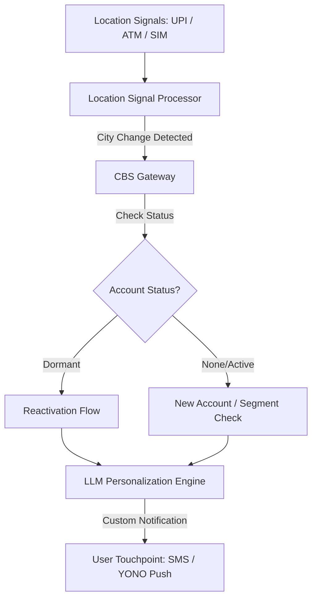

# NewCityAgent — Migrant Worker & Student Onboarding

NewCityAgent is an agentic banking solution designed to detect city-change patterns among internal migrants in India and proactively assist them with account reactivation, new account opening, and remittance setup. 

Developed as part of **Idea #7 (Pillar 1)**, this system aims to capture the critical transition window when a customer moves to a new city, preventing them from defaulting to informal channels or competitor banks.

---

##  Core Problem
* **The Scale:** Over 30 million internal migrants change cities annually in India.
* **The Opportunity Gap:** Banks often miss the exact moment of relocation, leading to customer churn or inactivity.
* **The Risk:** Migrants frequently default to informal money transfer channels or competitor financial institutions due to friction in local onboarding.

---

## User Personas
* **Internal Migrant Workers:** Individuals relocating for employment who require rapid, reliable remittance services to send money home to their families.
* **Students (Ages 18–24):** Individuals moving for higher education who require student accounts, digital payment setups, and potential education loan pre-qualification.

---

## Agentic Behavior & Hyper-Personalization
The agent monitors consented signals to identify relocation and tailors the outreach journey dynamically based on the customer's profile:

### 1. Relocation Detection (Consent-Based)
* **UPI Address Registry:** Changes in registered UPI addresses or frequent new local QR payments.
* **ATM Geolocation:** Transactions at ATMs in a new city or region.
* **SIM Roaming Signal:** Roaming network signals (where user permission is granted).

### 2. Tailored Journeys
* **Dormant Account Holders:** If the system detects a dormant SBI account, it prioritizes a guided reactivation flow.
* **Student Segment (Ages 18–24):** Offers student-specific account features and pre-qualification for educational loans.
* **Worker Segment:** Highlights remittance products, enabling low-friction domestic money transfers.

---

## ⚙️ Technical Architecture
The system consists of three primary components:
1. **Location Signal Processor (Mock):** Ingests and processes location-based event streams (UPI, ATM, SIM) to flag potential city changes.
2. **LLM-Driven Personalization Engine:** Generates customized, localized, and multi-lingual outreach messages based on user segment and destination city.
3. **Core Banking System (CBS) Gateway:** Interfaces with banking APIs to verify account status (active/dormant) and execute reactivation or opening workflows.

---

##  SBI Integration Points
* **UPI Address Registry:** For detecting billing and payment address updates.
* **YONO Geolocation Events:** To track mobile banking login locations.
* **CBS Dormancy Flag:** To check whether a returning customer has an inactive account.
* **Insta Account Engine:** For instant, digital-first account opening.
* **YONO Money Transfer Module:** To facilitate immediate remittance setup.

---

##  End-to-End Journey Flow
1. **Trigger:** The Location Signal Processor flags that a customer appears to be in a new city.
2. **Outreach:** The customer receives a push notification or SMS: 
   > *"Welcome to [City]. Your SBI account works nationwide — here is how to use it locally."*
3. **Reactivation (For Dormant Accounts):** Guided, in-app reactivation via YONO using Aadhaar OTP authentication.
4. **Onboarding (For New Accounts):** Insta Savings Account application flow presented in the customer's preferred regional language.
5. **Value Demonstration:** A localized demo of the remittance feature: 
   > *"Send money home in 10 seconds with YONO."*
6. **Engagement Nudge (Week 2):** A follow-up prompt to register for UPI to facilitate local QR-code payments.

---

## Compliance, Security & Privacy
* **Consented Data Only:** Location inference and tracking rely strictly on consented UPI, ATM, and app usage data.
* **Opt-Out Mechanism:** Users can easily opt out of location-based personalization at any time through their privacy settings.
* **Data Minimization:** No continuous GPS tracking is performed; analysis is event-driven based on transactional touchpoints.

---

##  Key Success Metrics
* **Dormant Account Reactivations:** Percentage of dormant accounts successfully reactivated post-relocation.
* **New Account Acquisition:** Conversion rate of newly arrived migrants without prior accounts.
* **Remittance Adoption:** Percentage of users completing their first domestic money transfer within 14 days of relocation.
* **UPI Velocity:** Active local transaction rate in the new city.

---

##  Hackathon Demo Scenario
The prototype demonstrates a complete end-to-end flow in a **4-minute scenario**:
1. A customer with a **dormant account** moves to a new city.
2. A simulated **city-change signal** is generated.
3. The system triggers a personalized welcome notification.
4. The customer completes **Aadhaar-based reactivation** and sets up a **remittance schedule** in a single flow.
