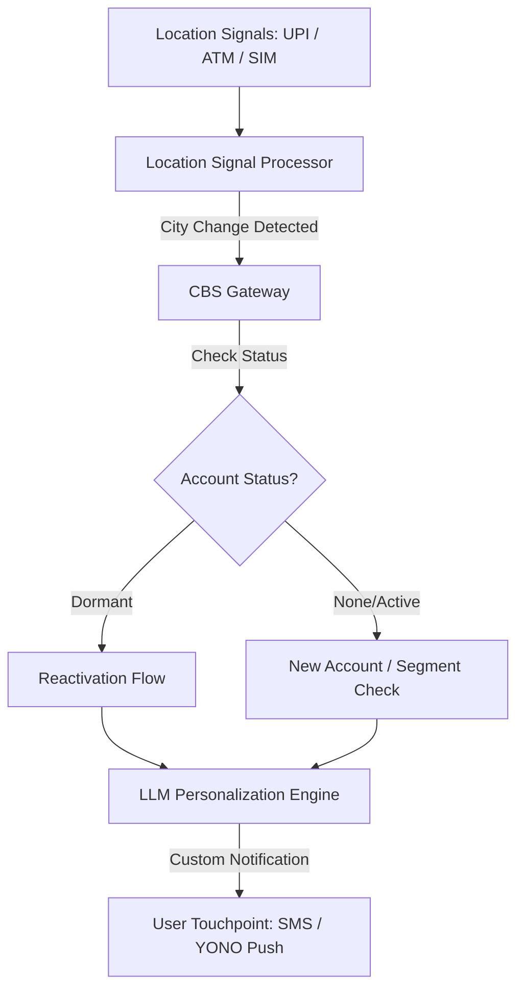

# NewCityAgent — Migrant Worker & Student Onboarding

NewCityAgent is an agentic banking solution designed to detect city-change patterns among internal migrants in India and proactively assist them with account reactivation, new account opening, and remittance setup.

Developed as part of **Idea #7 (Pillar 1)**, this system aims to capture the critical transition window when a customer moves to a new city, preventing them from defaulting to informal channels or competitor banks.

---

## Table of Contents

- [Core Problem](#core-problem)
- [User Personas](#user-personas)
- [Tech Stack](#tech-stack)
- [Project Structure](#project-structure)
- [Getting Started](#getting-started)
- [Frontend Pages](#frontend-pages)
- [Agentic Behavior & Hyper-Personalization](#agentic-behavior--hyper-personalization)
- [Technical Architecture](#technical-architecture)
- [SBI Integration Points](#sbi-integration-points)
- [End-to-End Journey Flow](#end-to-end-journey-flow)
- [Compliance, Security & Privacy](#compliance-security--privacy)
- [Key Success Metrics](#key-success-metrics)
- [Hackathon Demo Scenario](#hackathon-demo-scenario)

---

## Core Problem

- **The Scale:** Over 30 million internal migrants change cities annually in India.
- **The Opportunity Gap:** Banks often miss the exact moment of relocation, leading to customer churn or inactivity.
- **The Risk:** Migrants frequently default to informal money transfer channels or competitor financial institutions due to friction in local onboarding.

---

## User Personas

- **Internal Migrant Workers:** Individuals relocating for employment who require rapid, reliable remittance services to send money home to their families.
- **Students (Ages 18–24):** Individuals moving for higher education who require student accounts, digital payment setups, and potential education loan pre-qualification.

---

## Tech Stack

| Layer      | Technology                                                             |
| ---------- | ---------------------------------------------------------------------- |
| Frontend   | React 19, Vite 8, React Router 7, Lucide React (icons), Vanilla CSS   |
| Backend    | Node.js, Express 4, Google Generative AI (Gemini), Morgan (logging)    |
| Database   | In-memory JavaScript store (no external DB required)                   |
| Tooling    | Concurrently (monorepo dev runner), dotenv, oxlint                     |

---

## Project Structure

```
NewCityAgent/
├── package.json                  # Root — runs both frontend & backend via `concurrently`
│
├── backend/
│   ├── server.js                 # Express server entry point (port 3001)
│   ├── config.js                 # Environment config (Gemini API key, port)
│   ├── verify.js                 # Backend integration test script
│   └── src/
│       ├── db/
│       │   └── inMemoryDb.js     # In-memory user, signal & notification store
│       ├── routes/
│       │   └── api.js            # REST API endpoints (/api/*)
│       └── services/
│           ├── cbsService.js     # Core Banking System (CBS) mock gateway
│           ├── llmService.js     # Gemini LLM personalization engine
│           └── locationProcessor.js  # City-change detection logic
│
└── frontend/
    ├── vite.config.js            # Vite dev server (port 3000), proxies /api → :3001
    ├── index.html                # HTML entry
    └── src/
        ├── main.jsx              # React DOM mount
        ├── App.jsx               # Root layout, routing, shared InfoPanel
        ├── index.css             # Global CSS variables & dark/light theming
        ├── services/
        │   └── api.js            # Frontend HTTP client for backend APIs
        ├── components/
        │   └── layout/
        │       ├── Header.jsx    # Top header bar
        │       ├── Navbar.jsx    # Tab navigation (Dashboard / Demo / Customer / Signals)
        │       └── InfoPanel.jsx # Reusable instruction & system-logic panel
        └── pages/
            ├── Dashboard.jsx     # Admin control panel — trigger scenarios & reset state
            ├── DemoPage.jsx      # Guided 4-step demo walkthrough
            ├── CustomerView.jsx  # Simulated Android phone showing AI notifications
            └── SignalsPage.jsx   # Manual signal injection & signal log viewer
```

---

## Getting Started

### Prerequisites

- **Node.js** ≥ 18
- **npm** ≥ 9
- A **Gemini API key** (optional — the LLM service falls back to template messages without one)

### Installation

```bash
# Clone the repository
git clone https://github.com/your-org/NewCityAgent.git
cd NewCityAgent

# Install all dependencies (root + backend + frontend)
npm run install:all
```

### Environment Variables

Create a `.env` file inside `backend/`:

```env
GEMINI_API_KEY=your_gemini_api_key_here
```

### Running in Development

```bash
# From the project root — starts both backend (port 3001) and frontend (port 3000)
npm run dev
```

Or run them individually:

```bash
# Backend only
cd backend
npm start

# Frontend only (in a separate terminal)
cd frontend
npm run dev
```

Open **http://localhost:3000** in your browser.

### Running Tests

```bash
cd backend
npm test
```

---

## Frontend Pages

The app has four tabs, each accessible from the navigation bar. Every page includes a shared **InfoPanel** at the bottom that displays user instructions and an explanation of the system logic running under the hood.

| Tab                   | Route        | Description                                                                                          |
| --------------------- | ------------ | ---------------------------------------------------------------------------------------------------- |
| **Admin Dashboard**   | `/`          | Trigger pre-defined demo scenarios (Migrant Worker / Student) and reset backend state.               |
| **Guided Demo**       | `/demo`      | A 4-step interactive walkthrough: scenario → signal detection → onboarding → completion.             |
| **Customer Simulator**| `/customer`  | A simulated Android device that shows real-time AI notifications and supports OTP reactivation / remittance setup. |
| **Signal Injection**  | `/signals`   | Manually inject arbitrary location signals (phone + source + city) and inspect recent signal logs.   |

### Shared Layout

The `App.jsx` component provides the shared layout for all pages:
- **Header** — branding bar
- **Navbar** — tab navigation
- **Gradient Banner** — page title
- **Page Content** — route-specific component
- **InfoPanel** — contextual instructions and system logic (always at the bottom)

The InfoPanel content updates automatically based on the active route.

---

## Agentic Behavior & Hyper-Personalization

The agent monitors consented signals to identify relocation and tailors the outreach journey dynamically based on the customer's profile:

### 1. Relocation Detection (Consent-Based)

- **UPI Address Registry:** Changes in registered UPI addresses or frequent new local QR payments.
- **ATM Geolocation:** Transactions at ATMs in a new city or region.
- **SIM Roaming Signal:** Roaming network signals (where user permission is granted).

### 2. Tailored Journeys

- **Dormant Account Holders:** If the system detects a dormant SBI account, it prioritizes a guided reactivation flow.
- **Student Segment (Ages 18–24):** Offers student-specific account features and pre-qualification for educational loans.
- **Worker Segment:** Highlights remittance products, enabling low-friction domestic money transfers.

---

## Technical Architecture

The system consists of three primary components:

1. **Location Signal Processor (Mock):** Ingests and processes location-based event streams (UPI, ATM, SIM) to flag potential city changes.
2. **LLM-Driven Personalization Engine:** Generates customized, localized, and multi-lingual outreach messages based on user segment and destination city.
3. **Core Banking System (CBS) Gateway:** Interfaces with banking APIs to verify account status (active/dormant) and execute reactivation or opening workflows.



---

## SBI Integration Points

- **UPI Address Registry:** For detecting billing and payment address updates.
- **YONO Geolocation Events:** To track mobile banking login locations.
- **CBS Dormancy Flag:** To check whether a returning customer has an inactive account.
- **Insta Account Engine:** For instant, digital-first account opening.
- **YONO Money Transfer Module:** To facilitate immediate remittance setup.

---

## End-to-End Journey Flow

1. **Trigger:** The Location Signal Processor flags that a customer appears to be in a new city.
2. **Outreach:** The customer receives a push notification or SMS:
   > _"Welcome to [City]. Your SBI account works nationwide — here is how to use it locally."_
3. **Reactivation (For Dormant Accounts):** Guided, in-app reactivation via YONO using Aadhaar OTP authentication.
4. **Onboarding (For New Accounts):** Insta Savings Account application flow presented in the customer's preferred regional language.
5. **Value Demonstration:** A localized demo of the remittance feature:
   > _"Send money home in 10 seconds with YONO."_
6. **Engagement Nudge (Week 2):** A follow-up prompt to register for UPI to facilitate local QR-code payments.

---

## Compliance, Security & Privacy

- **Consented Data Only:** Location inference and tracking rely strictly on consented UPI, ATM, and app usage data.
- **Opt-Out Mechanism:** Users can easily opt out of location-based personalization at any time through their privacy settings.
- **Data Minimization:** No continuous GPS tracking is performed; analysis is event-driven based on transactional touchpoints.

---

## Key Success Metrics

- **Dormant Account Reactivations:** Percentage of dormant accounts successfully reactivated post-relocation.
- **New Account Acquisition:** Conversion rate of newly arrived migrants without prior accounts.
- **Remittance Adoption:** Percentage of users completing their first domestic money transfer within 14 days of relocation.
- **UPI Velocity:** Active local transaction rate in the new city.

---

## Hackathon Demo Scenario

The prototype demonstrates a complete end-to-end flow in a **4-minute scenario**:

1. A customer with a **dormant account** moves to a new city.
2. A simulated **city-change signal** is generated.
3. The system triggers a personalized welcome notification.
4. The customer completes **Aadhaar-based reactivation** and sets up a **remittance schedule** in a single flow.
